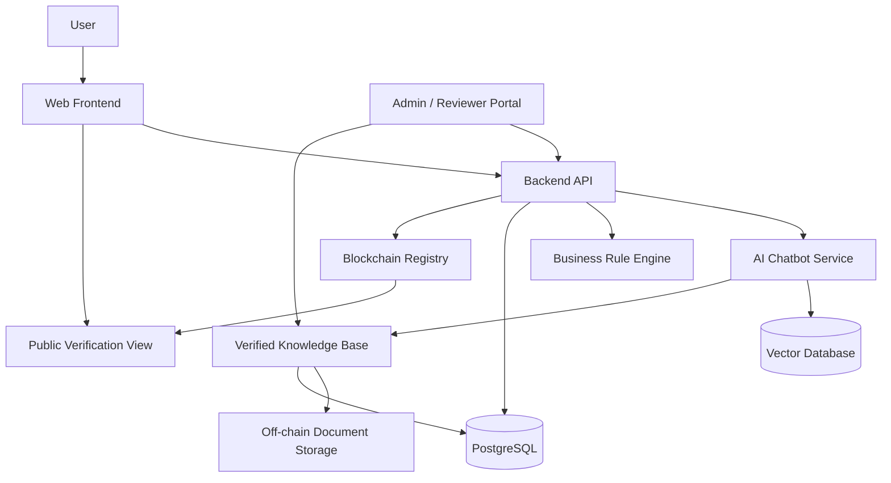

# Project Brief

Created: 2026-06-19

## 1. Title

Recommended title:

Da Nang BizGuide: AI and Blockchain-Based Regulatory Guidance Platform for Business Establishment in Da Nang City

Short name:

Da Nang BizGuide

Alternative academic titles:

- Trusted AI Chatbot for Business Registration Guidance in Da Nang Using Blockchain-Based Information Provenance
- A Blockchain-Secured Regulatory Knowledge Platform for Company Formation Support in Da Nang
- AI-Powered Business Establishment Assistant with Verifiable Legal Knowledge for Da Nang City

Keywords:

- AI chatbot
- Regulatory technology
- Business registration
- Da Nang
- Blockchain
- Knowledge provenance
- RAG
- Smart contracts
- E-government

## 2. Details / Problem Description

Da Nang is an important economic and innovation center in Central Vietnam. Many local founders, small business owners, and foreign investors want to open companies in the city, but the process can be difficult for people who are not familiar with Vietnamese business regulations, administrative procedures, official portals, document requirements, and post-registration obligations.

The information needed to start a company is often spread across many places: national business registration portals, city public service portals, legal document databases, tax systems, social insurance systems, investment promotion websites, and professional service providers. This creates several problems:

- New founders do not know which steps apply to their situation.
- Foreign investors may not understand the difference between investment registration, enterprise registration, tax registration, and sector-specific licenses.
- Information can become outdated when laws, forms, fees, or agency responsibilities change.
- Users may rely on unofficial summaries without knowing whether the information is accurate.
- A normal chatbot can produce fluent but unsupported answers if it is not connected to trusted sources.
- Important regulatory knowledge needs version history, review records, and integrity proof.

The project proposes a website and chatbot that guide users through the business establishment process in Da Nang. The chatbot will use a verified knowledge base and retrieval-augmented generation so answers can include source references and confidence boundaries. Important knowledge items, versions, and approvals will be recorded using blockchain-based hashes to provide tamper-evident provenance without exposing private user data.

The core problem is not only "how to answer business registration questions." The deeper research problem is how to build a trustworthy AI guidance system for regulatory information where accuracy, source traceability, update history, and user confidence are essential.

## 3. Objective

General objective:

Design and implement a trusted web platform that helps users understand company establishment requirements in Da Nang by combining an AI chatbot, a verified regulatory knowledge base, and blockchain-based information integrity verification.

Specific objectives:

- Build a user-friendly website for business setup guidance in Da Nang.
- Develop an AI chatbot that answers regulatory questions using verified source documents.
- Create a structured knowledge base for business registration steps, document requirements, agencies, official portals, and common user scenarios.
- Design an admin workflow for reviewing, approving, and versioning regulatory content.
- Use blockchain to store hashes and metadata for important approved knowledge versions.
- Provide source citations, last-verified dates, and confidence notes in chatbot answers.
- Evaluate the system using usability testing, answer accuracy testing, and blockchain integrity verification.

Research questions:

- How can an AI chatbot reduce the difficulty of understanding business establishment procedures in Da Nang?
- How can retrieval-augmented generation reduce hallucination risk in regulatory guidance?
- How can blockchain improve trust in the integrity and version history of legal/regulatory knowledge?
- What architecture is suitable for combining AI, official-source knowledge, and blockchain verification in an e-government support context?

Expected outputs:

- A working website prototype.
- A chatbot with source-backed answers.
- A curated regulatory knowledge base.
- Smart contracts for knowledge version registration.
- Admin interface for content approval and versioning.
- Technical documentation, architecture design, test results, and master thesis report.

Scope:

- Focus on company establishment guidance in Da Nang.
- Start with common company setup scenarios.
- Prioritize guidance, checklists, source citations, and official portal links.
- Store only hashes and metadata on-chain.

Out of scope for the first prototype:

- Replacing official government portals.
- Submitting legal applications directly on behalf of users.
- Providing formal legal advice.
- Storing personal identity documents on-chain.

## 4. Tech Used

Recommended stack for the prototype:

| Layer | Technology | Reason |
| --- | --- | --- |
| Frontend | Next.js, React, TypeScript, Tailwind CSS | Fast web development, strong UI structure, good multilingual support |
| Backend API | Python FastAPI | Good fit for AI services, APIs, and research prototypes |
| Database | PostgreSQL | Reliable relational storage for users, documents, versions, logs |
| Vector Search | pgvector or Qdrant | Retrieval for chatbot answers |
| AI / Chatbot | RAG pipeline, embeddings, LLM API or local LLM | Source-grounded answers and question understanding |
| Blockchain | Solidity, Hardhat, OpenZeppelin, Ethers.js | Practical smart contract prototype on an EVM-compatible chain |
| Off-chain Storage | S3-compatible storage, MinIO, or IPFS | Store source documents and snapshots outside the blockchain |
| Auth | OAuth/email login, role-based access control | Separate public users, reviewers, and admins |
| DevOps | Docker, Docker Compose, GitHub Actions | Reproducible local development and testing |
| Testing | Pytest, Playwright, smart contract tests | Backend, UI, and blockchain verification |

Possible later upgrade:

- Hyperledger Fabric can be considered if the thesis wants a permissioned-government architecture. For the first year, an EVM smart contract prototype is simpler and easier to demonstrate.

## 5. Architecture

High-level architecture:

Main components:

- Public website: landing experience, guided questionnaire, chatbot, checklist pages, source viewer, verification viewer.
- Chatbot service: understands user questions, retrieves relevant verified sources, generates answers with citations, and refuses unsupported legal claims.
- Knowledge base: stores source documents, extracted chunks, structured procedures, checklists, dates, reviewers, and version history.
- Admin portal: allows a reviewer to add official sources, update procedures, approve changes, and publish a new trusted version.
- Blockchain registry: records hashes of approved knowledge snapshots, source bundles, answer templates, and review events.
- Backend API: coordinates user sessions, chatbot calls, database operations, and blockchain verification.
- Database: stores users, conversations, documents, chunks, checklists, review status, and audit logs.

Blockchain design principle:

Do not store full legal documents, private user information, IDs, passports, or business files on-chain. Store only:

- Document hash
- Knowledge version hash
- Source URL hash or metadata hash
- Reviewer/admin approval hash
- Timestamp
- Version number
- Status

Example user flow:

1. User opens Da Nang BizGuide and chooses "Start a company in Da Nang."
2. The website asks key questions: nationality, business type, industry, number of founders, investment status, and preferred language.
3. The system generates a checklist and explains each step.
4. User asks the chatbot a follow-up question.
5. The chatbot retrieves official-source chunks from the knowledge base.
6. The chatbot answers with citations and a last-verified date.
7. User can click "verify knowledge version" to see the blockchain proof for the source bundle used.

