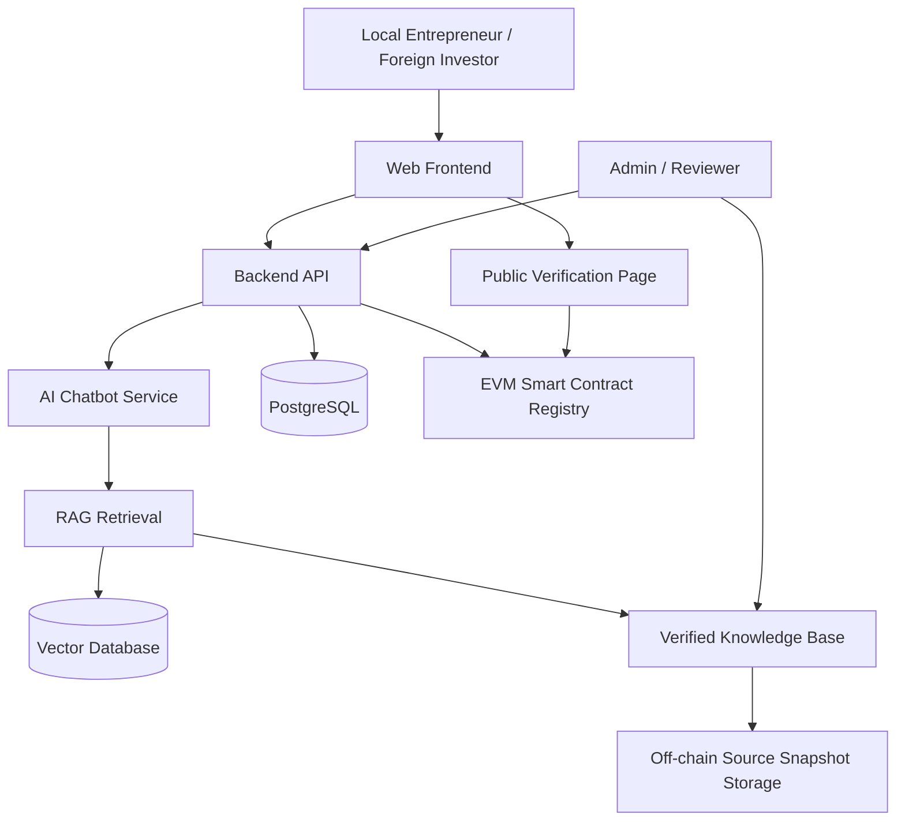

# Five-Section Project Proposal Draft

Status: Official draft v1 for supervisor review

Created: 2026-06-19

Document language: English

Project short name: Da Nang BizGuide

## Executive Summary

This project proposes **Da Nang BizGuide**, a trusted AI regulatory navigator that supports local Vietnamese entrepreneurs and foreign investors who want to establish a company in Da Nang City. The platform will provide scenario-based business establishment guidance through an AI chatbot, a structured regulatory knowledge base, and an EVM blockchain-based verification layer.

The main problem is not only that users need information. The deeper problem is that business establishment information is distributed across multiple official portals, legal documents, administrative procedures, and local support channels. Users may not know which rules apply to their situation, and ordinary AI chatbots may generate fluent but unsupported answers. In a legal and regulatory domain, this creates risk because inaccurate guidance can lead to incorrect document preparation, wasted time, or misunderstanding of obligations.

The proposed system addresses this issue by combining three layers of trust:

1. **Official-source grounding**: the chatbot answers from reviewed official documents and structured knowledge, not only from model memory.
2. **Retrieval-Augmented Generation (RAG)**: the AI retrieves relevant approved source content before generating an answer, reducing hallucination risk.
3. **EVM blockchain-based knowledge provenance**: hashes of approved knowledge versions, source snapshots, and approval metadata are stored on-chain to provide tamper-evident verification.

The expected contribution is a practical and research-oriented architecture for trusted AI regulatory guidance, where official documents improve answer reliability and blockchain verifies the integrity, approval history, and version provenance of the knowledge used by the chatbot.

## 1. Title

### Recommended Final Title

**Da Nang BizGuide: A Trusted AI Regulatory Navigator with EVM Blockchain-Based Knowledge Provenance for Business Establishment in Da Nang City**

### Short Product Name

**Da Nang BizGuide**

Meaning:

- **Biz** means business.
- **Guide** means a tool that helps users understand steps and make decisions.
- **Da Nang BizGuide** means a business guidance platform for people who want to establish a company in Da Nang.

### Alternative Academic Titles

1. A Trusted AI Regulatory Navigator with Blockchain-Based Knowledge Provenance for Business Establishment in Da Nang
2. Trusted AI Chatbot for Business Registration Guidance in Da Nang Using EVM-Based Knowledge Provenance
3. An EVM Blockchain-Secured Regulatory Knowledge Platform for Company Formation Support in Da Nang
4. AI-Powered Business Establishment Assistant with Verifiable Legal Knowledge for Da Nang City

### Rationale for the Recommended Title

The recommended title is selected because it clearly communicates the project scope, research contribution, and technology stack:

- It identifies the target location: **Da Nang City**.
- It identifies the application domain: **business establishment and regulatory guidance**.
- It describes the AI role as a **regulatory navigator**, not merely a chatbot.
- It identifies the blockchain role as **knowledge provenance**, which is more precise than saying blockchain is used only for trust.
- It specifies **EVM blockchain**, which aligns with the planned smart contract prototype and low-cost EVM-compatible deployment strategy.

### Keywords

- AI chatbot
- Retrieval-Augmented Generation
- Regulatory technology
- Business establishment
- Enterprise registration
- Da Nang
- EVM blockchain
- Smart contracts
- Knowledge provenance
- Tamper-evident verification
- E-government

## 2. Details / Problem Description

### 2.1 Project Context

Da Nang is developing as a center for innovation, digital economy, investment, and startup activity in Central Vietnam. Local Vietnamese entrepreneurs and foreign investors may want to establish companies in the city, but they often face difficulty understanding which procedures, documents, agencies, and official portals apply to their situation.

Business establishment is not a single-step process. Depending on the user scenario, it may involve enterprise registration, investment registration for foreign investors, tax registration, sector-specific business conditions, post-registration obligations, official forms, public service portals, and updated legal documents. These sources are often written in formal administrative or legal language, which can be difficult for new founders and investors to understand.

At the same time, AI chatbots are becoming popular as information assistants. However, a normal chatbot may produce confident answers that are not grounded in official sources. This is especially risky in legal and regulatory guidance because an incorrect answer may cause users to prepare wrong documents, misunderstand legal obligations, or waste time during the registration process.

### 2.2 Evidence That the Problem Is Important

The project should use verified official and reputable sources during thesis writing. Current evidence candidates include:

- The Government of Vietnam has approved programs to cut and simplify administrative procedures related to production and business activities for 2025 and 2026, including targets for reducing procedure processing time and compliance costs.
- VietnamPlus reported that thousands of administrative procedures and business conditions had been cut or simplified, with significant reductions in processing time and compliance costs compared with 2024.
- National public service development shows that Vietnam is moving administrative services toward digital platforms.
- Da Nang has positioned itself as an innovation and startup-oriented city, including startup support and digital public-service development.
- The national business database direction shows increasing interest in transparent, structured, and interoperable business information.

These points support the argument that administrative simplification, business support, innovation, and trusted digital public services are real priorities in Vietnam and Da Nang.

Preliminary source candidates for final citation:

- Government Portal of Vietnam: https://en.baochinhphu.vn/govt-approves-program-to-cut-and-simplify-administrative-procedures-for-2025-2026-111250327100445608.htm
- VietnamPlus: https://en.vietnamplus.vn/over-3400-administrative-procedures-business-conditions-cut-or-simplified-post344619.vnp
- Viet Nam News: https://vietnamnews.vn/economy/1725482/project-on-national-business-database-approved.html
- Da Nang official portal: https://www.danang.gov.vn/
- Da Nang Center for Innovation Startup Support: https://startupdanang.vn/en/about
- National Business Registration Portal: https://dangkykinhdoanh.gov.vn/
- National Public Service Portal: https://dichvucong.gov.vn/
- National Legal Document Database: https://vbpl.vn/

### 2.3 Target Users

Primary users:

- Local Vietnamese entrepreneurs who want to open a company in Da Nang.
- Foreign investors who want to establish a company in Da Nang.
- Startup founders who need a step-by-step checklist.

Secondary users:

- Business support staff.
- Legal or consulting service providers.
- Investment promotion staff.
- Admins and reviewers who maintain trusted regulatory knowledge.
- Researchers and examiners evaluating AI, blockchain, and e-government systems.

### 2.4 User Pain Points

Local Vietnamese entrepreneurs may ask:

- What type of company should I open?
- What documents do I need?
- Which official portal should I use?
- What should I do after receiving the enterprise registration certificate?
- Are there tax, invoice, seal, labor, or social insurance steps after registration?

Foreign investors may ask:

- Do I need investment registration before enterprise registration?
- What is different between a foreign-owned company and a local company?
- Which business lines are conditional?
- Which documents must be prepared and translated?
- Which official agency or portal is relevant?

Common problems:

- Information is spread across multiple official sources.
- Users may not know which regulation applies to their scenario.
- Legal language is difficult to understand.
- Information can change over time.
- Unofficial websites may be outdated or incomplete.
- Normal AI chatbots can hallucinate if they do not use official sources.
- Users may trust a fluent AI answer without checking its source.

### 2.5 Problem Statement

There is a need for a trusted digital platform that helps local Vietnamese entrepreneurs and foreign investors understand business establishment procedures in Da Nang through official-source-based AI guidance, while also providing verifiable proof that important regulatory knowledge has been reviewed, versioned, and not secretly modified.

### 2.6 Why This Is Not Just a Normal Website or Chatbot

A normal website can publish information, but it usually does not provide personalized, scenario-based guidance. A normal chatbot can explain information, but it may not prove where the answer came from or whether the knowledge was reviewed and unchanged.

This project improves the normal chatbot model by using:

- Official documents as the trusted knowledge source.
- Retrieval-Augmented Generation to reduce hallucination.
- Source citations and last-verified dates.
- Human review for important legal and regulatory knowledge.
- EVM blockchain hashes to prove version integrity and approval history.

### 2.7 Why Blockchain Is Needed

Blockchain is not used because government websites are untrusted. A government domain can prove institutional ownership, but blockchain solves a different problem: it proves the integrity and version history of the specific knowledge used by the AI system.

The project uses blockchain to answer questions such as:

- Which version of the knowledge base did the chatbot use?
- Was this checklist changed after reviewer approval?
- Can the system detect if an approved source snapshot was modified?
- When was a knowledge version approved?
- Can a user or auditor verify that the displayed information matches the approved version?

The core thesis argument is:

**Official sources provide authority. RAG reduces hallucination. EVM blockchain provides tamper-evident provenance and version verification.**

### 2.8 Problem Scale and Measurable Impact

The project should be explained using the same logic as a crisis-support app example, but with a business and public-service context.

In a crisis-support application, the problem is urgent demand coordination: many people need food, medicine, or support, and the system reduces delay and confusion. In this project, the problem is administrative and regulatory coordination: founders and investors need correct guidance, but the information is distributed across official portals, legal documents, and local procedures.

The affected group is focused but important:

- Local entrepreneurs planning to open companies in Da Nang.
- Foreign investors evaluating whether and how to establish a company.
- Startup teams preparing documents and procedures.
- Public-service or business-support staff who answer repeated questions.
- Reviewers and administrators who maintain trusted regulatory knowledge.

The project should not claim impact percentages before implementation. Instead, impact should be measured through controlled evaluation.

Possible measurable outcomes after evaluation:

- Reduction in time needed to find correct procedure information.
- Reduction in unsupported chatbot answers.
- Improvement in user trust when citations and blockchain verification are displayed.
- Successful detection of modified approved knowledge through blockchain hash mismatch.
- Improvement in checklist clarity compared with manual search.

### 2.9 Information Needed to Prove the Problem

To make the thesis stronger, the research phase should collect:

- Number of new enterprises registered in Da Nang per year.
- Number of foreign investment projects or foreign-invested enterprises in Da Nang.
- Public-service usage data related to business or investment procedures, if available.
- Common questions asked by local founders and foreign investors.
- Common mistakes in document preparation, if available from interviews or staff feedback.
- Number of official portals and documents that users need to check.
- Frequency of legal or procedure updates.
- User survey results showing difficulty, time spent, and trust level before using the prototype.

These data points will help the thesis move from "this seems useful" to "this solves a measurable problem."

### 2.10 Alternative AI and Blockchain Ideas Considered

| Idea | Problem Solved | Strength | Limitation |
| --- | --- | --- | --- |
| Crisis relief and essential supply app | Food, medicine, and urgent support coordination | Large social impact and clear urgency | Requires real-time logistics and sensitive data |
| Drug authenticity and medicine guidance | Safe medicine and verified supply chain | Strong blockchain provenance use case | Healthcare domain is high-risk and harder to test |
| Education certificate verification with AI career guidance | Certificate verification and student guidance | Simple blockchain verification use case | Less connected to Da Nang business establishment |
| Public procurement transparency assistant | Tender transparency and auditability | Strong accountability angle | Sensitive domain and harder data access |
| Da Nang business establishment guidance | Trusted regulatory guidance for founders and investors | Realistic scope, available official sources, strong AI and blockchain fit | Requires careful legal disclaimers and source verification |

Recommended choice:

The Da Nang business establishment project is the best fit for a master project because it balances real-world relevance, local importance, available official sources, feasible implementation, AI usefulness, and clear blockchain justification.

## 3. Objective

### 3.1 General Objective

To design and implement a trusted AI and EVM blockchain-based platform that supports local Vietnamese entrepreneurs and foreign investors in understanding business establishment procedures in Da Nang City through official-source-backed guidance and verifiable knowledge integrity.

### 3.2 Specific Objectives

1. Build a user-friendly website that provides business establishment guidance for local entrepreneurs and foreign investors in Da Nang.
2. Develop an AI chatbot that answers user questions using official-source-based retrieval instead of relying only on model memory.
3. Create a structured regulatory knowledge base containing procedures, official sources, checklists, document requirements, business scenarios, and version metadata.
4. Design a human review workflow for approving and updating important legal and regulatory knowledge.
5. Implement an EVM smart contract registry that stores hashes of approved knowledge versions, source snapshots, and approval metadata.
6. Provide a public verification page where users can check whether a knowledge version matches the blockchain record.
7. Evaluate the prototype based on answer accuracy, citation quality, hallucination reduction, usability, trust, and blockchain tamper detection.

### 3.3 Research Questions

1. How can an AI chatbot help users understand business establishment procedures in Da Nang?
2. How can official-source-based RAG reduce hallucination in regulatory guidance?
3. How can EVM blockchain improve trust through knowledge provenance, version verification, and tamper detection?
4. How should legal and regulatory knowledge be collected, reviewed, versioned, and verified in an AI-assisted public-service platform?
5. How effective is the proposed prototype for local Vietnamese entrepreneurs and foreign investors?

### 3.4 Expected Contributions

Academic contributions:

- A reference architecture for combining AI, official-source knowledge, and EVM blockchain verification in a regulatory guidance system.
- A method for reducing AI hallucination in business procedure guidance through RAG and human-reviewed knowledge.
- A smart contract-based design for verifying approved regulatory knowledge versions.
- An evaluation framework for chatbot accuracy, source citation quality, user trust, and tamper detection.

Practical contributions:

- A working website prototype for business establishment guidance in Da Nang.
- A chatbot that answers with official-source citations.
- A checklist generator for local-founder and foreign-investor scenarios.
- A blockchain verification feature for approved knowledge versions.
- Documentation and source code that can be extended for future e-government or startup-support systems.

### 3.5 Evaluation Targets

The following targets are proposed for evaluation. They are not claimed results before implementation.

| Evaluation Area | Proposed Target |
| --- | --- |
| Source-backed chatbot answers | At least 90% of evaluated answers include relevant official-source citations |
| Unsupported legal claims | Less than 5% in the controlled test question set |
| User task efficiency | Reduce time to find key procedure information by 40-60% compared with manual search in a small user test |
| Checklist usefulness | At least 80% of test users rate the checklist as clear and useful |
| Blockchain tamper detection | Detect 100% of modified approved knowledge versions through hash mismatch |
| User trust | Users report higher trust when citations and blockchain verification are shown |

### 3.6 Scope

Included in the first version:

- Local Vietnamese founder scenario.
- Foreign investor scenario.
- Business establishment checklist.
- Chatbot with official-source retrieval.
- Vietnamese and English user-facing content direction.
- English project documentation.
- EVM smart contract for knowledge version verification.

Not included in the first version:

- Replacing official government portals.
- Submitting official applications directly.
- Providing formal legal advice.
- Storing identity documents on blockchain.
- Handling every possible business sector or license.

## 4. Tech Used

### 4.1 Recommended Technology Stack

| Layer | Technology | Purpose |
| --- | --- | --- |
| Frontend | Next.js, React, TypeScript, Tailwind CSS | Website, chatbot UI, checklist UI, verification page |
| Backend | Python FastAPI | APIs, business logic, chatbot orchestration |
| Database | PostgreSQL | Users, sources, checklists, review workflow, version metadata |
| Vector Search | pgvector or Qdrant | Retrieve relevant official-source chunks for chatbot answers |
| AI / Chatbot | RAG pipeline, embeddings, LLM API or local LLM | Question answering with official-source grounding |
| Blockchain | Solidity, Hardhat, OpenZeppelin, Ethers.js | EVM smart contract development and integration |
| Deployment Blockchain | Low-cost EVM-compatible network or Layer 2 | Reduce deployment and transaction cost |
| Storage | Local storage, S3-compatible storage, MinIO, or IPFS | Store source snapshots outside blockchain |
| Testing | Pytest, Playwright, Hardhat tests | Backend, UI, and smart contract testing |
| DevOps | Docker, Docker Compose, GitHub Actions | Reproducible development and CI |

### 4.2 Why AI Is Used

AI is used because users do not always know the correct legal keywords, procedure names, or official document titles. They want to ask questions in natural language and receive understandable step-by-step guidance.

Main AI features:

- Natural-language chatbot.
- Question classification.
- Scenario-based guidance.
- Checklist explanation.
- Summarization of official-source content.
- Follow-up questions when user context is missing.

### 4.3 Why RAG Is Used

RAG, or Retrieval-Augmented Generation, is used to reduce hallucination. Instead of allowing the chatbot to answer from memory, the system first retrieves relevant verified source chunks from the knowledge base. The chatbot then generates an answer based on those retrieved sources and includes citations.

### 4.4 Why EVM Blockchain Is Used

EVM blockchain is used because:

- It is popular and widely supported.
- Solidity and Hardhat are mature tools.
- Smart contracts are easy to demonstrate in a master project.
- Many low-cost EVM-compatible networks exist.
- The same smart contract logic can run locally, on testnets, or on low-cost networks.

The project should not deploy first to Ethereum mainnet because the transaction cost is unnecessary for the prototype. Better demonstration options include:

- Local Hardhat network.
- Sepolia testnet.
- Polygon.
- Base.
- Arbitrum.
- Optimism.
- BNB Smart Chain.

### 4.5 What Blockchain Stores

Blockchain stores only proof metadata:

- Approved knowledge version hash.
- Source snapshot hash.
- Approval metadata hash.
- Version ID.
- Timestamp.
- Status.
- Smart contract event log.

Blockchain does not store:

- Full legal documents.
- User identity documents.
- Private chatbot conversations.
- Passport, ID card, or business files.
- Passwords, emails, or personal data.

## 5. Architecture

### 5.1 High-Level Architecture

### 5.2 Main Components

Frontend:

- User homepage.
- Guided questionnaire.
- Chatbot interface.
- Checklist view.
- Source citation view.
- Blockchain verification page.

Backend API:

- User session logic.
- Checklist generation.
- Chatbot orchestration.
- Source and knowledge management.
- Blockchain integration.

AI chatbot service:

- Receives user questions.
- Retrieves official-source content.
- Generates answers with citations.
- Refuses unsupported claims.
- Asks follow-up questions when user context is missing.

Knowledge base:

- Stores official source metadata.
- Stores extracted text chunks.
- Stores procedures and checklists.
- Stores version status.
- Stores reviewer approval records.

EVM blockchain registry:

- Stores hashes of approved versions.
- Stores event logs for approval and version registration.
- Supports verification by comparing current content hashes with on-chain hashes.

Admin portal:

- Adds official sources.
- Reviews source extraction.
- Edits checklist content.
- Approves knowledge versions.
- Publishes version hashes to blockchain.

### 5.3 Chatbot Answer Flow

1. The user asks a question.
2. The backend identifies the user scenario, such as local founder or foreign investor.
3. The RAG service searches approved official-source chunks.
4. The AI generates an answer using retrieved content.
5. The answer includes source citations and last-verified date.
6. The backend checks the knowledge version against the blockchain registry.
7. The user sees the answer, citations, and verification status.

### 5.4 Knowledge Update Flow

1. An admin adds or updates an official source.
2. The system stores a source snapshot off-chain.
3. A reviewer checks the extracted information.
4. The reviewer approves a new knowledge version.
5. The system calculates a hash of the approved version.
6. The smart contract stores the content hash and metadata hash.
7. The verification page can prove whether displayed content matches the approved version.

### 5.5 Suggested Smart Contract

Contract name:

`KnowledgeRegistry`

Main functions:

- `registerVersion(versionId, contentHash, metadataHash)`
- `updateVersionStatus(versionId, status)`
- `getVersion(versionId)`
- `verifyVersion(versionId, contentHash, metadataHash)`

Events:

- `VersionRegistered`
- `VersionStatusChanged`

### 5.6 Blockchain Feature Summary

| Feature | Purpose |
| --- | --- |
| Knowledge version hash | Proves approved content was not secretly modified |
| Source snapshot hash | Proves which source version was used |
| Approval metadata hash | Proves review and approval history |
| Verification page | Makes blockchain verification visible to users |
| Tamper detection | Detects database or content modification after approval |

### 5.7 Privacy and Security Principles

- Keep private data off-chain.
- Store only approved knowledge in the chatbot retrieval index.
- Show source citations for legal and regulatory answers.
- Keep conversation logs separate from official source snapshots.
- Require authentication and authorization for admin/reviewer actions.
- Use blockchain only for hashes and proof metadata.
- Add clear disclaimers that the system provides guidance, not formal legal advice.

## 6. Defense Against Expected Examiner Questions

### Question 1: Why not just build a normal website?

A normal website can publish information, but it does not provide AI-based personalized guidance, source-grounded answers, or tamper-evident verification of the knowledge version used by the chatbot.

### Question 2: Why not just host the website on a government domain?

A government domain proves institutional ownership, but it does not automatically prove the version history and integrity of every knowledge item used by the AI chatbot. Blockchain adds a verifiable audit layer for approved knowledge versions.

### Question 3: Is blockchain too much for this project?

Blockchain is used only for a narrow and practical purpose: storing hashes and proof metadata. It is not used as a normal database. This keeps the system practical while still providing tamper-evident provenance.

### Question 4: Why use AI if official portals already exist?

Official portals are important, but users may not know where to search or how to interpret legal procedures. AI helps convert official information into scenario-based guidance and step-by-step checklists.

### Question 5: How does the system reduce hallucination?

The chatbot uses RAG. It retrieves approved official-source content before answering. It also shows citations, last-verified dates, and refuses unsupported legal claims.

### Question 6: Is private data stored on blockchain?

No. The system stores only hashes and metadata on-chain. Personal documents, user conversations, identity documents, and full legal texts remain off-chain.

### Question 7: What is the measurable contribution?

The project can measure answer accuracy, citation quality, hallucination rate, user task time, user trust, and blockchain tamper detection. These metrics make the thesis stronger than a simple implementation report.

### Question 8: Is this problem large enough?

Yes, if the project is framed correctly. The goal is not to serve every citizen. The goal is to solve a focused public-service and business-support problem for entrepreneurs, foreign investors, startup teams, and staff who need reliable regulatory information. The thesis should prove the problem using Da Nang business registration data, foreign investment data, user interviews, and usability testing.

### Question 9: Why is this better than other AI and blockchain ideas?

Other ideas such as crisis relief, medicine provenance, and public procurement may have bigger social impact, but they are harder to access, harder to test, and may involve sensitive operational or medical data. This project is more suitable for a master timeline because official sources are available, the prototype can be tested safely, and the AI plus blockchain contribution is clear.

### Question 10: What is the main contribution in one sentence?

The project contributes a trusted regulatory guidance architecture where official documents reduce AI hallucination and EVM blockchain verifies the integrity, approval history, and version provenance of the knowledge used by the chatbot.

## 7. Confirmed Direction and Remaining Evidence

### Confirmed Direction

1. Final title: **Da Nang BizGuide: A Trusted AI Regulatory Navigator with EVM Blockchain-Based Knowledge Provenance for Business Establishment in Da Nang City**.
2. Main scope: both local Vietnamese entrepreneur and foreign investor scenarios.
3. Product language direction: Vietnamese and English user-facing content.
4. Documentation language: English.
5. Blockchain network: EVM prototype with low-cost EVM-compatible deployment.
6. Main technical contribution: official-source RAG plus blockchain-based knowledge provenance.

### Remaining Evidence to Collect

1. Da Nang enterprise registration statistics.
2. Da Nang foreign investment statistics.
3. Public-service usage data related to business procedures, if available.
4. Interviews or survey answers from local founders, foreign investors, or support staff.
5. A controlled question set for chatbot accuracy evaluation.
6. A user test comparing manual search with Da Nang BizGuide.
7. A blockchain tamper-detection test report.

### Next Deliverable

After supervisor approval, this draft can be converted into a polished `.docx` proposal document or expanded into the first thesis proposal chapter.
