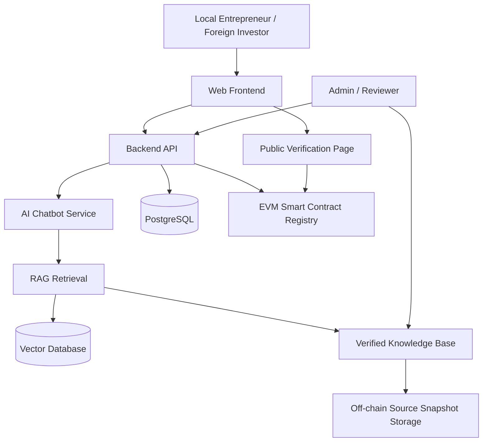

# Five-Section Brainstorming Draft

Status: Draft for review

Created: 2026-06-19

Document language: English

Purpose: This document is for brainstorming and supervisor discussion before creating the final `.docx` file. It expands the five whiteboard sections: Title, Details / Problem Description, Objective, Tech Used, and Architecture.

## 1. Title

### Recommended Title

Da Nang BizGuide: A Trusted AI and EVM Blockchain Platform for Business Establishment Guidance in Da Nang City

### Short Product Name

Da Nang BizGuide

Meaning:

- "Biz" means business.
- "Guide" means a tool that helps users understand steps and make decisions.
- "Da Nang BizGuide" means a business guidance platform for people who want to establish a company in Da Nang.

### Alternative Academic Titles

1. Trusted AI Chatbot for Business Registration Guidance in Da Nang Using EVM-Based Knowledge Provenance
2. An EVM Blockchain-Secured Regulatory Knowledge Platform for Company Formation Support in Da Nang
3. AI-Powered Business Establishment Assistant with Verifiable Legal Knowledge for Da Nang City
4. A Trusted Regulatory Navigator for Local Entrepreneurs and Foreign Investors in Da Nang

### Recommended Final Choice

The strongest title is:

Da Nang BizGuide: A Trusted AI and EVM Blockchain Platform for Business Establishment Guidance in Da Nang City

Reasons:

- It clearly shows the location: Da Nang City.
- It clearly shows the domain: business establishment guidance.
- It clearly shows the technologies: AI and EVM blockchain.
- It uses the word "trusted," which matches the problem of official information, AI hallucination, and knowledge verification.
- It is still understandable for non-technical readers.

### Keywords

- AI chatbot
- Retrieval-Augmented Generation
- Regulatory technology
- Business establishment
- Enterprise registration
- Da Nang
- EVM blockchain
- Smart contracts
- Knowledge provenance
- Tamper-evident verification
- E-government

## 2. Details / Problem Description

### Project Context

Da Nang is developing as a center for innovation, digital economy, investment, and startup activity in Central Vietnam. Local Vietnamese entrepreneurs and foreign investors may want to establish companies in Da Nang, but they often face difficulty understanding which procedures, documents, agencies, and official portals are relevant to their situation.

Business establishment information is not a single simple answer. It may involve enterprise registration, investment registration for foreign investors, tax registration, sector-specific business conditions, post-registration obligations, official forms, public service portals, and updated legal documents. This information changes over time and may be written in formal legal language that is difficult for new founders to understand.

At the same time, AI chatbots are becoming popular, but a normal chatbot can generate confident answers that are not based on official sources. This is dangerous in legal and regulatory guidance because wrong information can cause users to prepare incorrect documents, misunderstand legal obligations, or lose time during the registration process.

### Evidence That The Problem Is Important

The project should use verified sources during thesis writing. Current evidence candidates include:

- The Government of Vietnam approved a program for cutting and simplifying administrative procedures related to production and business activities for 2025 and 2026. The program targets at least 30 percent reduction of unnecessary investment conditions, at least 30 percent reduction of procedure processing time, and 30 percent reduction of compliance costs in 2025. In 2026, processing time and compliance costs are targeted to be reduced by half compared with 2024.
- The same Government Portal article states that 4,435 out of 6,367 administrative procedures had been made available on the National Public Service Portal, showing the national direction toward online public services.
- Da Nang's official portal reported that the city ranked highly in innovation indicators and entered the global Top 1,000 startup ecosystems in 2025, showing the city's direction toward innovation and startup development.
- The Da Nang Center for Innovation Startup Support is a public service unit under the Da Nang Department of Science and Technology and supports innovation, startup programs, sandbox activities, and related policy communication.

These points support the argument that administrative simplification, business support, innovation, and digital public services are real priorities in Vietnam and Da Nang.

Candidate sources for final citation:

- Government Portal of Vietnam: https://en.baochinhphu.vn/govt-approves-program-to-cut-and-simplify-administrative-procedures-for-2025-2026-111250327100445608.htm
- Da Nang official portal: https://www.danang.gov.vn/
- Da Nang Center for Innovation Startup Support: https://startupdanang.vn/en/about
- National Business Registration Portal: https://dangkykinhdoanh.gov.vn/
- National Public Service Portal: https://dichvucong.gov.vn/
- National Legal Document Database: https://vbpl.vn/

### Target Users

Primary users:

- Local Vietnamese entrepreneurs who want to open a company in Da Nang.
- Foreign investors who want to establish a company in Da Nang.
- Startup founders who need a step-by-step checklist.

Secondary users:

- Business support staff.
- Legal or consulting service providers.
- Investment promotion staff.
- Admins and reviewers who maintain trusted regulatory knowledge.
- Researchers and examiners evaluating AI, blockchain, and e-government systems.

### User Pain Points

Local Vietnamese entrepreneurs may ask:

- What type of company should I open?
- What documents do I need?
- Which official portal should I use?
- What should I do after receiving the enterprise registration certificate?
- Are there tax, invoice, seal, or labor/social insurance steps after registration?

Foreign investors may ask:

- Do I need investment registration before enterprise registration?
- What is different between a foreign-owned company and a local company?
- Which business lines are conditional?
- Which documents must be prepared and translated?
- Which official agency or portal is relevant?

Common problems:

- Information is spread across multiple official sources.
- Users may not know which regulation applies to their scenario.
- Legal language is difficult to understand.
- Information can change over time.
- Unofficial websites may be outdated or incomplete.
- Normal AI chatbots can hallucinate if they do not use official sources.
- Users may trust a fluent AI answer without checking the source.

### Problem Statement

There is a need for a trusted digital platform that helps local Vietnamese entrepreneurs and foreign investors understand business establishment procedures in Da Nang through official-source-based AI guidance, while providing verifiable proof that important regulatory knowledge has been reviewed, versioned, and not secretly modified.

### Why This Is Not Just A Normal Chatbot

A normal chatbot can explain information, but it may not prove where the answer came from.

This project improves the chatbot by using:

- Official documents as the knowledge source.
- Retrieval-Augmented Generation to reduce hallucination.
- Source citations and last-verified dates.
- Human review for important knowledge.
- EVM blockchain hashes to prove version integrity and approval history.

### Why Blockchain Is Needed

Blockchain is not used because `.gov` websites are untrusted. A government domain can prove institutional ownership, but blockchain solves a different problem: it proves the integrity and version history of the specific knowledge used by the AI system.

The project uses blockchain to answer questions such as:

- Which version of the knowledge base did the chatbot use?
- Was this checklist changed after reviewer approval?
- Can we detect if an approved source snapshot was modified?
- When was a knowledge version approved?
- Can a user or auditor verify that the displayed information matches the approved version?

Best thesis argument:

Official sources provide authority. RAG reduces hallucination. EVM blockchain provides tamper-evident provenance and version verification.

## 3. Objective

### General Objective

To design and implement a trusted AI and EVM blockchain-based platform that supports local Vietnamese entrepreneurs and foreign investors in understanding business establishment procedures in Da Nang City through official-source-backed guidance and verifiable knowledge integrity.

### Specific Objectives

1. Build a user-friendly website that provides business establishment guidance for local entrepreneurs and foreign investors in Da Nang.
2. Develop an AI chatbot that answers user questions using official-source-based retrieval instead of relying only on model memory.
3. Create a structured regulatory knowledge base containing procedures, official sources, checklists, document requirements, business scenarios, and version metadata.
4. Design a human review workflow for approving and updating important legal/regulatory knowledge.
5. Implement an EVM smart contract registry that stores hashes of approved knowledge versions, source snapshots, and approval metadata.
6. Provide a public verification page where users can check whether a knowledge version matches the blockchain record.
7. Evaluate the prototype based on answer accuracy, citation quality, hallucination reduction, usability, trust, and blockchain tamper detection.

### Research Questions

1. How can an AI chatbot help users understand business establishment procedures in Da Nang?
2. How can official-source-based RAG reduce hallucination in regulatory guidance?
3. How can EVM blockchain improve trust through knowledge provenance, version verification, and tamper detection?
4. How should legal/regulatory knowledge be collected, reviewed, versioned, and verified in an AI-assisted public-service platform?
5. How effective is the proposed prototype for local Vietnamese entrepreneurs and foreign investors?

### Expected Contributions

Academic contributions:

- A reference architecture for combining AI, official-source knowledge, and EVM blockchain verification in a regulatory guidance system.
- A method for reducing AI hallucination in business procedure guidance through RAG and human-reviewed knowledge.
- A smart contract-based design for verifying approved regulatory knowledge versions.
- An evaluation framework for chatbot accuracy, source citation quality, user trust, and tamper detection.

Practical contributions:

- A working website prototype for business establishment guidance in Da Nang.
- A chatbot that answers with official-source citations.
- A checklist generator for local-founder and foreign-investor scenarios.
- A blockchain verification feature for approved knowledge versions.
- Documentation and source code that can be extended for future e-government or startup-support systems.

### Evaluation Targets

These are proposed targets for the prototype evaluation. They are not claimed results yet.

| Evaluation Area | Proposed Target |
| --- | --- |
| Source-backed chatbot answers | At least 90% of evaluated answers include relevant official-source citations |
| Unsupported legal claims | Less than 5% in the controlled test question set |
| User task efficiency | Reduce time to find key procedure information by 40-60% compared with manual search in a small user test |
| Checklist usefulness | At least 80% of test users rate the checklist as clear and useful |
| Blockchain tamper detection | Detect 100% of modified approved knowledge versions through hash mismatch |
| User trust | Users report higher trust when citations and blockchain verification are shown |

### Scope

Included in the first version:

- Local Vietnamese founder scenario.
- Foreign investor scenario.
- Business establishment checklist.
- Chatbot with official-source retrieval.
- English project documentation.
- Vietnamese and English user-facing content direction.
- EVM smart contract for knowledge version verification.

Not included in the first version:

- Replacing official government portals.
- Submitting official applications directly.
- Giving formal legal advice.
- Storing identity documents on blockchain.
- Handling every possible business sector or license.

## 4. Tech Used

### Recommended Technology Stack

| Layer | Technology | Purpose |
| --- | --- | --- |
| Frontend | Next.js, React, TypeScript, Tailwind CSS | Website, chatbot UI, checklist UI, verification page |
| Backend | Python FastAPI | APIs, business logic, chatbot orchestration |
| Database | PostgreSQL | Users, sources, checklists, review workflow, version metadata |
| Vector Search | pgvector or Qdrant | Retrieve relevant official-source chunks for chatbot answers |
| AI / Chatbot | RAG pipeline, embeddings, LLM API or local LLM | Question answering with official source grounding |
| Blockchain | Solidity, Hardhat, OpenZeppelin, Ethers.js | EVM smart contract development and integration |
| Deployment Blockchain | Low-cost EVM-compatible network or Layer 2 | Reduce deployment and transaction cost |
| Storage | Local storage, S3-compatible storage, MinIO, or IPFS | Store source snapshots outside blockchain |
| Testing | Pytest, Playwright, Hardhat tests | Backend, UI, and smart contract testing |
| DevOps | Docker, Docker Compose, GitHub Actions | Reproducible development and CI |

### Why AI Is Used

AI is used because users do not always know the correct legal keywords or procedure names. They want to ask questions in natural language and receive understandable step-by-step guidance.

AI features:

- Natural-language chatbot.
- Question classification.
- Scenario-based guidance.
- Checklist explanation.
- Summarization of official-source content.
- Follow-up questions when user context is missing.

### Why RAG Is Used

RAG, or Retrieval-Augmented Generation, is used to reduce hallucination.

Instead of allowing the chatbot to answer from memory, the system first retrieves relevant verified source chunks from the knowledge base. The chatbot then generates an answer based on those retrieved sources and includes citations.

### Why EVM Blockchain Is Used

EVM blockchain is used because:

- It is popular and widely supported.
- Solidity and Hardhat are mature tools.
- Smart contracts are easy to demonstrate in a master project.
- Many low-cost EVM-compatible networks exist.
- The same smart contract logic can run locally, on testnets, or on low-cost networks.

The project should not deploy first to Ethereum mainnet because the transaction cost is unnecessary. Better options for demonstration include:

- Local Hardhat network.
- Sepolia testnet.
- Polygon.
- Base.
- Arbitrum.
- Optimism.
- BNB Smart Chain.

### What Blockchain Stores

Blockchain should store only proof metadata:

- Approved knowledge version hash.
- Source snapshot hash.
- Approval metadata hash.
- Version ID.
- Timestamp.
- Status.
- Smart contract event log.

Blockchain should not store:

- Full legal documents.
- User identity documents.
- Private chatbot conversations.
- Passport, ID card, or business files.
- Passwords, emails, or personal data.

## 5. Architecture

### High-Level Architecture

### Main Components

Frontend:

- User homepage.
- Guided questionnaire.
- Chatbot interface.
- Checklist view.
- Source citation view.
- Blockchain verification page.

Backend API:

- User session logic.
- Checklist generation.
- Chatbot orchestration.
- Source and knowledge management.
- Blockchain integration.

AI chatbot service:

- Receives user question.
- Retrieves official-source content.
- Generates answer with citations.
- Refuses unsupported claims.
- Asks follow-up questions when needed.

Knowledge base:

- Stores official source metadata.
- Stores extracted text chunks.
- Stores procedures and checklists.
- Stores version status.
- Stores reviewer approval records.

EVM blockchain registry:

- Stores hashes of approved versions.
- Stores event logs for approval/version registration.
- Supports verification by comparing current content hash with on-chain hash.

Admin portal:

- Add source.
- Review source extraction.
- Edit checklist content.
- Approve knowledge version.
- Publish version hash to blockchain.

### Chatbot Answer Flow

1. User asks a question.
2. Backend identifies user scenario, such as local founder or foreign investor.
3. RAG service searches approved official-source chunks.
4. AI generates an answer using only retrieved content.
5. Answer includes source citations and last-verified date.
6. Backend checks the knowledge version against the blockchain registry.
7. User sees the answer and verification status.

### Knowledge Update Flow

1. Admin adds or updates an official source.
2. System stores a source snapshot off-chain.
3. Reviewer checks extracted information.
4. Reviewer approves a new knowledge version.
5. System calculates a hash of the approved version.
6. Smart contract stores the hash and metadata hash.
7. Verification page can prove whether displayed content matches the approved version.

### Suggested Smart Contract

Contract name:

`KnowledgeRegistry`

Main functions:

- `registerVersion(versionId, contentHash, metadataHash)`
- `updateVersionStatus(versionId, status)`
- `getVersion(versionId)`
- `verifyVersion(versionId, contentHash, metadataHash)`

Events:

- `VersionRegistered`
- `VersionStatusChanged`

### Blockchain Feature Summary

| Feature | Why It Matters |
| --- | --- |
| Knowledge version hash | Proves approved content was not secretly modified |
| Source snapshot hash | Proves which source version was used |
| Approval metadata hash | Proves review and approval history |
| Verification page | Makes blockchain useful to normal users |
| Tamper detection | Detects database/content modification after approval |

## Opponent / Examiner Questions

### Question 1: Why not just build a normal website?

A normal website can publish information, but it does not provide AI-based personalized guidance, source-grounded answers, or tamper-evident verification of the knowledge version used by the chatbot.

### Question 2: Why not just host it on a `.gov` domain?

A `.gov` domain proves institutional ownership, but it does not automatically prove the version history and integrity of every knowledge item used by the AI chatbot. Blockchain adds a verifiable audit layer for approved knowledge versions.

### Question 3: Why use blockchain? Is it too much?

Blockchain is used only for a narrow and useful purpose: storing hashes and proof metadata. It is not used as a normal database. This keeps the system practical while still providing tamper-evident provenance.

### Question 4: Why use AI if official portals already exist?

Official portals are important, but users may not know where to search or how to interpret legal procedures. AI helps convert official information into scenario-based guidance and step-by-step checklists.

### Question 5: How do you reduce hallucination?

The chatbot uses RAG. It retrieves approved official-source content before answering. It also shows citations, last-verified dates, and refuses unsupported legal claims.

### Question 6: Is private data stored on blockchain?

No. The system stores only hashes and metadata on-chain. Personal documents, user conversations, identity documents, and full legal texts remain off-chain.

### Question 7: What is the measurable contribution?

The project can measure answer accuracy, citation quality, hallucination rate, user task time, user trust, and blockchain tamper detection. These metrics make the thesis stronger than a simple implementation report.

## Brainstorming Decisions To Approve

Please review and decide:

1. Final title: Keep the recommended title or choose an alternative?
2. Main scope: Start with both local founder and foreign investor scenarios?
3. Product language: Vietnamese and English user-facing content, with English thesis documentation?
4. Blockchain network: EVM prototype with low-cost EVM-compatible deployment?
5. Evaluation targets: Are the proposed targets realistic for your supervisor and timeline?
6. DOCX export: After approval, generate a polished `.docx` file from this content?

