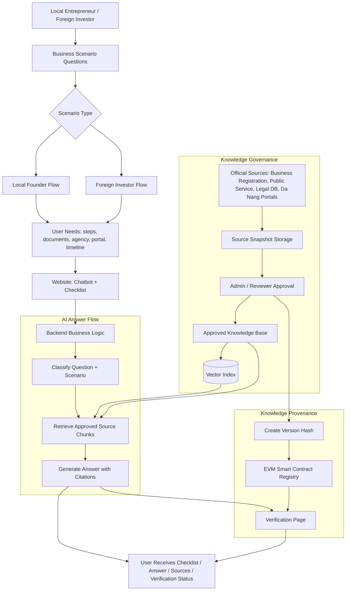

# Five-Section Project Draft

## 1. Title

**Da Nang BizGuide: AI and Blockchain Regulatory Navigator**

Short name: **Da Nang BizGuide**

Main idea:

**A Trusted AI Regulatory Navigator with EVM Blockchain-Based Knowledge Provenance for Business Establishment in Da Nang City**

Meaning:

- **Biz** means business.
- **Guide** means a tool that helps users understand steps and make decisions.
- **Da Nang BizGuide** means a guidance platform for people who want to establish a company in Da Nang.

Main keywords:

- AI chatbot
- Retrieval-Augmented Generation (RAG)
- Regulatory technology
- Business establishment
- Da Nang
- EVM blockchain
- Knowledge provenance
- Smart contract
- E-government

## 2. Details / Problem Description

Da Nang is developing as a city for innovation, startups, digital economy, and investment. Local Vietnamese entrepreneurs and foreign investors may want to establish companies in Da Nang, but they often face difficulty understanding the correct procedures, documents, agencies, official portals, and legal requirements.

Business establishment is not a simple one-step process. Depending on the user scenario, it may involve enterprise registration, investment registration for foreign investors, tax registration, post-registration obligations, business lines, official forms, and updated legal documents. This information is distributed across many official sources and is often written in formal administrative or legal language.

The problem becomes more serious when users rely on normal AI chatbots. A normal chatbot may produce confident but unsupported answers. In a legal and regulatory context, this can lead to wrong document preparation, misunderstanding of obligations, wasted time, or reduced trust in digital public services.

This project focuses on two main user groups:

- Local Vietnamese entrepreneurs who want to open a company in Da Nang.
- Foreign investors who want to establish a company in Da Nang.

The key user problems are:

- Users do not know where to start.
- Users do not know which procedure applies to their case.
- Official information is spread across different portals and documents.
- Legal language is difficult for non-experts.
- Regulations and procedures may change over time.
- AI answers may hallucinate if they are not based on official sources.
- Users need to know which sources support the chatbot answer.

Evidence and source mapping:

| Evidence / data                                                                                                                                                                                                                                                            | Source                                                                                                                                                           | How it supports the problem                                                                                                                    |
| -------------------------------------------------------------------------------------------------------------------------------------------------------------------------------------------------------------------------------------------------------------------------- | ---------------------------------------------------------------------------------------------------------------------------------------------------------------- | ---------------------------------------------------------------------------------------------------------------------------------------------- |
| Vietnam's Government approved a 2025-2026 program to reduce and simplify administrative procedures for production and business activities. The program targets at least 30% reduction in unnecessary investment conditions, processing time, and compliance costs in 2025. | Government Portal of Vietnam: https://en.baochinhphu.vn/govt-approves-program-to-cut-and-simplify-administrative-procedures-for-2025-2026-111250327100445608.htm | Shows that administrative procedures and business conditions are complex enough to require national-level simplification.                      |
| The same Government Portal article reports that 4,435 of 6,367 administrative procedures were available on the National Public Service Portal, equal to 69.6%.                                                                                                             | Government Portal of Vietnam                                                                                                                                     | Shows that public services are moving online, but users still need help finding and understanding the correct digital procedure.               |
| VietnamPlus reported that 3,466 administrative procedures and business conditions had been cut or simplified, procedure time was reduced by 53%, and compliance costs fell by 54.6% compared with 2024.                                                                    | VietnamPlus: https://en.vietnamplus.vn/over-3400-administrative-procedures-business-conditions-cut-or-simplified-post344619.vnp                                  | Shows the scale of business procedure reform and proves that procedure complexity is a real public-service problem.                            |
| VietnamPlus also reported that the National Public Service Portal publicised 5,816 administrative procedures, connected with 151 systems/databases, and provided online access to 4,968 procedures.                                                                        | VietnamPlus                                                                                                                                                      | Shows that official information is large, distributed, and connected across many systems, which creates a navigation problem for users.        |
| The National Business Database project plans to connect business registration, tax, import-export, social insurance, credit, investment, labour, innovation, and digital transformation data, and apply AI, machine learning, and big data tools.                          | Viet Nam News: https://vietnamnews.vn/economy/1725482/project-on-national-business-database-approved.html                                                        | Supports the idea that business information is fragmented across many datasets and that AI/data technologies are relevant to business support. |
| Da Nang ranked 8th among 34 provinces/cities in the 2024 Provincial Innovation Index and entered StartupBlink's global Top 1,000 startup ecosystems in 2024.                                                                                                               | Da Nang Innovation Startup Support Center: https://startupdanang.vn/en/about                                                                                     | Supports the local relevance of a startup and business-support platform for Da Nang.                                                           |
| The Da Nang Center for Innovation Startup Support is a public service unit under the Da Nang Department of Science and Technology and supports innovation, startup policy communication, public services, data/statistics, and startup ecosystem development.              | Da Nang Innovation Startup Support Center                                                                                                                        | Shows that Da Nang already has public startup-support functions, so this project aligns with local development direction.                      |

The proposed solution is a website with an AI chatbot and checklist system. The chatbot will not answer only from model memory. It will use official documents and reviewed knowledge through RAG, so answers can include citations, source links, and last-verified information.

Blockchain is used in a narrow and practical way. It is not used because government websites are untrusted. In a government environment, official portals already provide strong institutional trust. Instead, EVM blockchain is used as an optional audit and transparency layer for the AI system. It records hashes of approved knowledge versions, source snapshots, and approval metadata. This helps prove which reviewed knowledge version was used by the chatbot and whether that version still matches the approved record.

Core problem statement:

**There is a need for a trusted AI-based platform that helps local entrepreneurs and foreign investors understand business establishment procedures in Da Nang using official-source-backed guidance, while providing verifiable provenance for the regulatory knowledge used by the chatbot.**

Preliminary official source candidates:

- Da Nang official portal: https://www.danang.gov.vn/
- National Business Registration Portal: https://dangkykinhdoanh.gov.vn/
- National Public Service Portal: https://dichvucong.gov.vn/
- National Legal Document Database: https://vbpl.vn/
- Da Nang investment/startup support sources

Source-to-system mapping:

| System data part                                | Main source                                                 | Used for                                                        |
| ----------------------------------------------- | ----------------------------------------------------------- | --------------------------------------------------------------- |
| Business registration procedure                 | National Business Registration Portal                       | Checklist steps, chatbot answers, official portal links         |
| Administrative procedure availability           | National Public Service Portal                              | Public-service links, online procedure guidance                 |
| Laws, decrees, circulars, and valid legal text  | National Legal Document Database                            | Legal basis citations and knowledge base references             |
| Da Nang local business/startup support          | Da Nang official portal and Da Nang startup support sources | Local context, local support channels, local policy references  |
| Reform statistics and problem evidence          | Government Portal, VietnamPlus, Viet Nam News               | Problem justification, thesis background, measurable motivation |
| Approved knowledge version                      | Internal reviewer/admin workflow                            | RAG retrieval, chatbot answer source package, blockchain proof  |
| Knowledge version hash and source snapshot hash | EVM smart contract registry                                 | Verification page, audit trail, tamper detection                |

## 3. Objective

General objective:

**To design and implement a trusted AI regulatory guidance platform that helps local Vietnamese entrepreneurs and foreign investors understand business establishment procedures in Da Nang City through official-source-backed answers and EVM blockchain-based knowledge provenance.**

Specific objectives:

1. Build a user-friendly website for business establishment guidance in Da Nang.
2. Develop an AI chatbot that answers questions using official-source-based RAG.
3. Create a structured knowledge base for procedures, source documents, checklists, business scenarios, and version metadata.
4. Provide checklist guidance for local-founder and foreign-investor scenarios.
5. Add a reviewer/admin workflow for approving important regulatory knowledge.
6. Implement an EVM smart contract registry for approved knowledge version hashes and source snapshot hashes.
7. Provide a verification page showing the knowledge version, source references, and blockchain proof.
8. Evaluate the system using chatbot accuracy, citation quality, usability, user trust, and hash verification tests.

Research questions:

1. How can AI help users understand business establishment procedures in Da Nang?
2. How can official-source-based RAG reduce hallucination in regulatory guidance?
3. How can EVM blockchain provide knowledge provenance for AI-generated regulatory answers?
4. How effective is the prototype for local Vietnamese entrepreneurs and foreign investors?

Expected contribution:

- A practical architecture for trusted AI regulatory guidance.
- A chatbot that answers with official-source citations.
- A checklist system for company establishment in Da Nang.
- A blockchain-based proof layer for approved knowledge versions.
- A prototype that can be evaluated through measurable tests.

Initial evaluation targets:

- At least 90% of tested chatbot answers include relevant official citations.
- Unsupported legal claims stay below 5% in the test question set.
- Users complete common guidance tasks faster than manual search in a small user test.
- Blockchain verification detects changed approved knowledge through hash mismatch.

## 4. Tech Used

Recommended technology stack:

| Layer              | Technology                                           | Purpose                                               |
| ------------------ | ---------------------------------------------------- | ----------------------------------------------------- |
| Frontend           | Next.js, React, TypeScript, Tailwind CSS             | Website, chatbot UI, checklist UI, verification page  |
| Backend            | NestJS, TypeScript, Prisma                           | APIs, chatbot orchestration, business logic           |
| Database           | PostgreSQL                                           | Users, sources, checklists, review workflow, metadata |
| Vector Search      | pgvector or Qdrant                                   | Retrieve official-source chunks for chatbot answers   |
| AI / Chatbot       | RAG pipeline, embeddings, LLM API or local LLM       | Source-grounded question answering                    |
| Blockchain         | Solidity, Hardhat, OpenZeppelin, Ethers.js           | EVM smart contract development                        |
| Deployment Network | Low-cost EVM-compatible network or Layer 2           | Reduce deployment and transaction cost                |
| Storage            | Local storage, S3-compatible storage, MinIO, or IPFS | Store source snapshots off-chain                      |
| Testing            | Jest, Playwright, Hardhat tests                      | Backend, UI, and smart contract testing               |

Repository split for deployment:

| Repository                   | Responsibility                                                    |
| ---------------------------- | ----------------------------------------------------------------- |
| `da-nang-bizguide`           | Documentation, roadmap, architecture, thesis materials            |
| `da-nang-bizguide-frontend`  | Next.js frontend                                                  |
| `da-nang-bizguide-api`       | NestJS backend API                                                |
| `da-nang-bizguide-contracts` | Solidity contracts and deployment scripts                         |
| `da-nang-bizguide-worker`    | Optional later worker for indexing, queues, and blockchain events |

Why AI is used:

- Users can ask questions in natural language.
- The system can explain complex procedures in simpler steps.
- The chatbot can generate scenario-based guidance.
- The system can summarize official-source information.

Why RAG is used:

- The chatbot retrieves approved official-source content before answering.
- Answers can include citations and last-verified information.
- The risk of hallucination is reduced.

Why EVM blockchain is used:

- EVM is popular, mature, and easy to demonstrate.
- Solidity and Hardhat provide strong development tools.
- Smart contracts can record proof metadata for approved knowledge versions.
- Deployment can use a low-cost EVM-compatible network instead of Ethereum mainnet.

Blockchain stores only proof metadata:

- Approved knowledge version hash.
- Source snapshot hash.
- Approval metadata hash.
- Version ID.
- Timestamp.
- Status.

Blockchain does not store:

- Full legal documents.
- User identity documents.
- Private chatbot conversations.
- Passport, ID card, or business files.
- Passwords, emails, or personal data.

## 5. Architecture

High-level architecture by business workflow:

Main components:

- **Business scenario questions**: identify whether the user is a local founder or foreign investor and what business context applies.
- **Web frontend**: chatbot, checklist, source citation display, verification page.
- **Backend business logic**: user scenario handling, chatbot orchestration, checklist generation, source package selection, blockchain verification.
- **AI chatbot service**: retrieves official-source content, generates cited answers, refuses unsupported claims.
- **Knowledge base**: stores official sources, extracted chunks, checklists, scenarios, version metadata, and review status.
- **Admin/reviewer portal**: adds sources, reviews knowledge, approves versions.
- **EVM smart contract registry**: stores hashes and proof metadata for approved knowledge versions.
- **Off-chain storage**: stores official source snapshots and documents outside blockchain.

User business workflow:

1. User selects or describes a scenario.
2. System identifies the user as local founder or foreign investor.
3. System asks missing business questions, such as business type, industry, number of founders, and investment context.
4. System generates a checklist and allows the user to ask follow-up questions.
5. Chatbot answers using approved official-source knowledge.
6. User sees the answer, source citations, and knowledge verification status.

Chatbot answer workflow:

1. User asks a question.
2. Backend identifies the user scenario and question intent.
3. RAG retrieves approved official-source chunks from the vector index.
4. AI generates an answer using retrieved content.
5. Answer shows citations and last-verified date.
6. System checks the knowledge version hash against the blockchain registry.
7. User sees the answer, sources, and verification status.

Knowledge update workflow:

1. Admin adds or updates an official source.
2. System stores the source snapshot off-chain.
3. Reviewer checks and approves the extracted knowledge.
4. System creates an approved knowledge version.
5. System calculates the version hash.
6. Smart contract stores the hash and metadata hash.
7. Verification page confirms whether the displayed knowledge matches the approved version.

Suggested smart contract:

`KnowledgeRegistry`

Main functions:

- `registerVersion(versionId, contentHash, metadataHash)`
- `updateVersionStatus(versionId, status)`
- `getVersion(versionId)`
- `verifyVersion(versionId, contentHash, metadataHash)`

The architecture keeps the main system practical: the database stores real content, RAG supports AI answers, and blockchain only verifies important approved knowledge versions.
