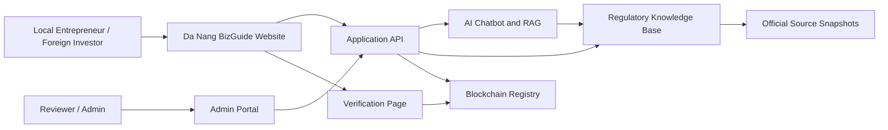
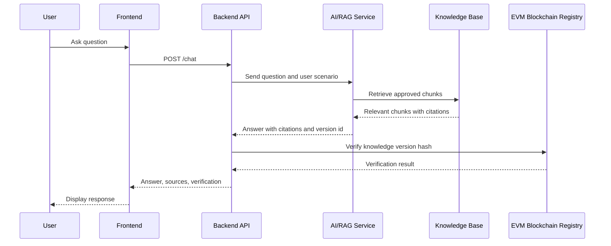
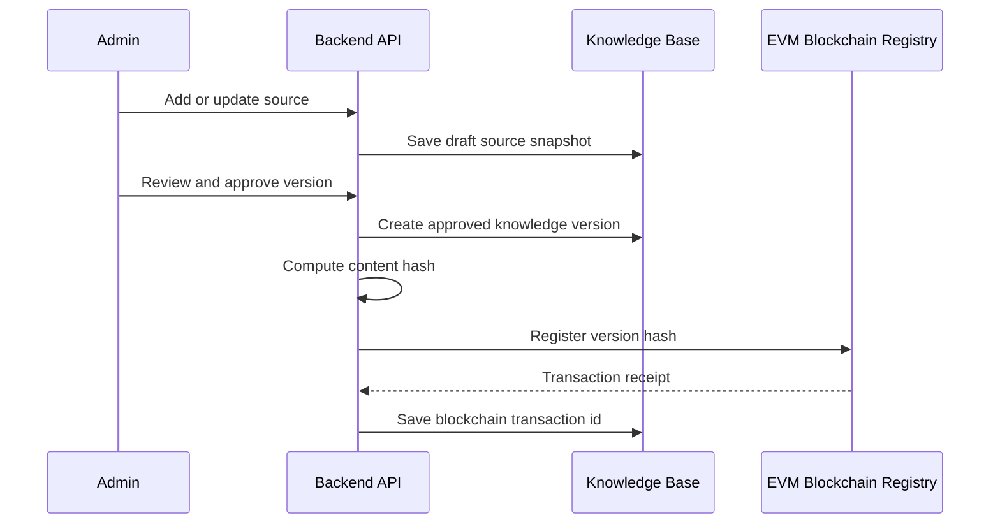

# Architecture V1

## Architecture Goal

The platform should provide trustworthy business establishment guidance by connecting four layers:

- User experience layer
- AI guidance layer
- Verified regulatory knowledge layer
- EVM blockchain integrity layer

## System Context

## Main Components

### 1. Web Frontend

Responsibilities:

- Present chatbot interface.
- Present guided questionnaire.
- Show generated checklists.
- Show source citations.
- Show blockchain proof status.
- Support Vietnamese and English UI for the main user groups.

Suggested implementation:

- Next.js
- React
- TypeScript
- Tailwind CSS
- Playwright tests

### 2. Backend API

Responsibilities:

- Manage users and sessions.
- Provide chatbot endpoint.
- Provide checklist endpoint.
- Connect to database, vector store, and blockchain.
- Save conversation metadata.
- Enforce role-based access for admin/reviewer users.

Suggested implementation:

- NestJS
- TypeScript
- PostgreSQL
- Prisma
- Jest

Project folder:

- `backend/`

### 3. AI Chatbot Service

Responsibilities:

- Classify user question intent.
- Retrieve relevant knowledge chunks.
- Generate answer with citations.
- Identify missing context and ask follow-up questions.
- Refuse unsupported claims.
- Provide confidence and last-verified metadata.

Recommended answer rule:

The chatbot should answer only from approved knowledge base content. If the answer cannot be found, it should say that the information is not available and suggest official sources or human review.

### 4. Knowledge Base

Responsibilities:

- Store official source metadata.
- Store extracted source text.
- Store structured business procedures.
- Store checklist templates.
- Store document requirements.
- Store version status: draft, review, approved, archived.
- Store reviewer notes.

Core entities:

- SourceDocument
- SourceSnapshot
- KnowledgeChunk
- Procedure
- ChecklistTemplate
- BusinessScenario
- KnowledgeVersion
- ReviewApproval

### 5. EVM Blockchain Registry

Responsibilities:

- Register approved knowledge version hashes.
- Register source bundle hashes.
- Register approval event hashes.
- Allow public verification by hash.
- Emit events for audit history.

Prototype implementation:

- Solidity smart contracts.
- Hardhat development and testing.
- Ethers.js integration.
- Local EVM network during development.
- Low-cost EVM-compatible network or Layer 2 for demo deployment.

Project folder:

- `contract/`

Ethereum mainnet is not required for the first deployment because the project only needs verifiable proof of integrity, not high-value financial settlement.

Data stored on-chain:

- `versionId`
- `contentHash`
- `metadataHash`
- `approvedBy`
- `approvedAt`
- `status`

Data stored off-chain:

- Source document text.
- Legal documents.
- User conversations.
- Personal data.
- Admin notes.

### 6. Admin Portal

Responsibilities:

- Add official source URLs.
- Upload source snapshots.
- Review extracted text.
- Edit structured checklist content.
- Approve new knowledge versions.
- Publish approved versions to blockchain registry.

## Data Flow: Chatbot Answer

## Data Flow: Knowledge Update

## Security and Trust Principles

- Keep private data off-chain.
- Store only approved knowledge in the chatbot retrieval index.
- Show source citations for every legal/regulatory answer.
- Keep conversation logs separate from source documents.
- Require admin/reviewer login for knowledge changes.
- Keep version history immutable in the application database and verifiable on-chain.
- Add disclaimers that the system provides guidance, not formal legal advice.

## Suggested Smart Contract

Contract name:

`KnowledgeRegistry`

Functions:

- `registerVersion(versionId, contentHash, metadataHash)`
- `updateStatus(versionId, status)`
- `getVersion(versionId)`
- `verifyVersion(versionId, contentHash, metadataHash)`

Events:

- `VersionRegistered`
- `VersionStatusChanged`

Future functions:

- multi-reviewer approval
- organization-based permissions
- revoked or superseded version markers
